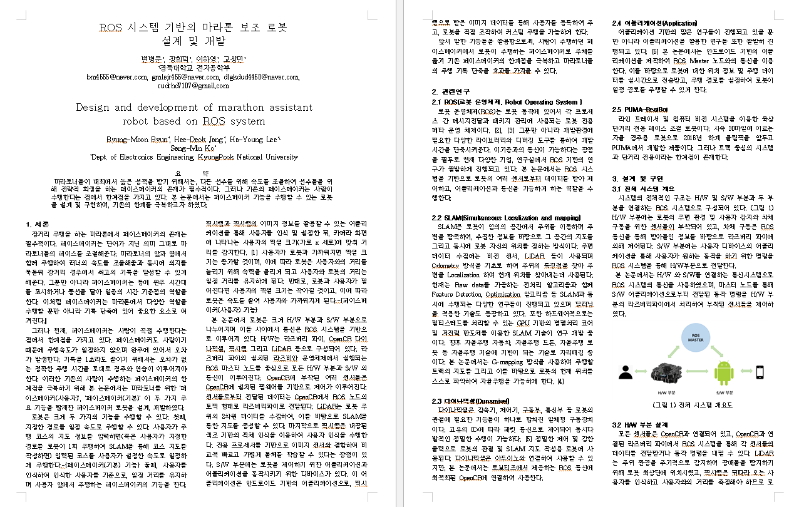
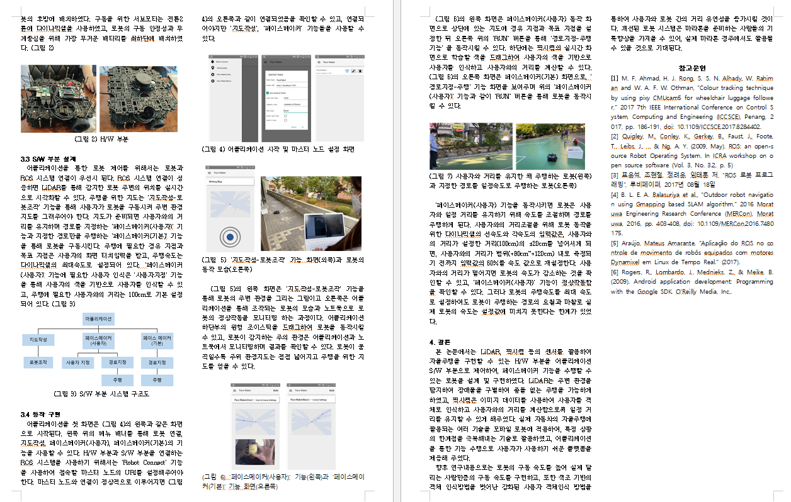
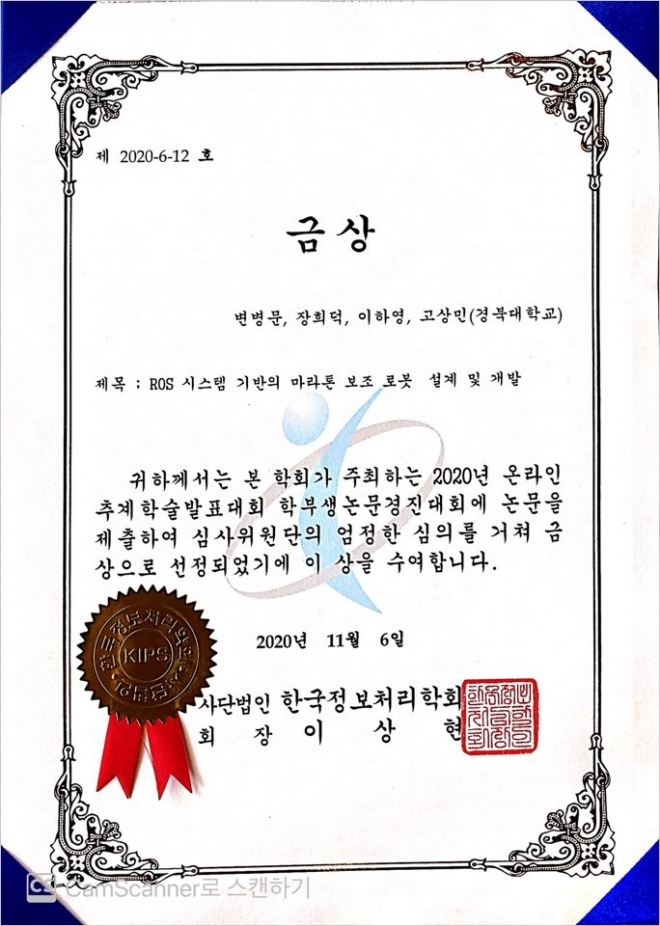

**본 폴더는 종합설계프로젝트 1학기 주제였던 'RunningMate Robot'을 토대로 작성한 논문 관련 폴더입니다.**

### 주제  

ROS 시스템 기반의 마라톤 보조 로봇 설계 및 개발

### 요약

마라토너들이 대회에서 높은 성적을 받기 위해서는, 다른 선수를 위해 속도를 조율하여 선수들을 위해 전략적 희생을 하는 페이스메이커의 존재가 필수적이다. 그러나 기존의 페이스메이커는 사람이 수행한다는 점에서 한계점을 가지고 있다. 본 논문에서는 페이스메이커 기능을 수행할 수 있는 로봇을 설계 및 구현하여, 기존의 한계를 극복하고자 하였다.

### 관련 자료

### 결과

> 금상 수상

